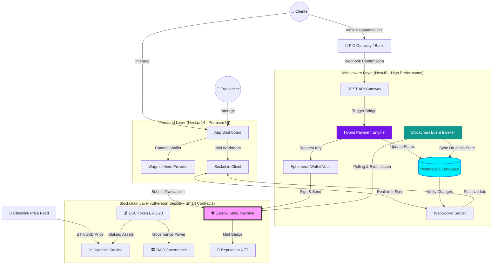

# 💎 PayWeb3 — Ecossistema de Marketplace & Protocolo de Escrow Híbrido

> **Arquitetura de Próxima Geração para Liquidação de Serviços Digitais: Pagamentos Híbridos, Staking Algorítmico e Governança Descentralizada.**

---

## 🏛️ 1. Visão Geral do Sistema

O **PayWeb3** é uma infraestrutura "Full-Stack Web3" de nível empresarial projetada para eliminar o risco de contraparte em transações globais. O sistema integra a imutabilidade da blockchain com uma camada de middleware de alta performance e uma interface de usuário intuitiva.

Diferente de marketplaces tradicionais, o PayWeb3 não detém a custódia dos fundos; eles são geridos por **Smart Contracts auditáveis**, garantindo que o pagamento só ocorra mediante a entrega verificada do serviço.

### Pilares de Engenharia:

1.  **Trustless Escrow:** Liquidação financeira via código, sem intermediários humanos.
2.  **Hybrid Gateway:** Pontes de pagamento para PIX e Cripto com carteiras efêmeras.
3.  **Reactive Indexing:** Sincronização em milissegundos entre On-chain e Off-chain.
4.  **Algorithmic Incentives:** Recompensas de staking ajustadas via Oráculos Chainlink.

---

## ⚠️ 2. O Desafio e a Tese de Solução

### O Problema (Market Failures)

O mercado freelancer global sofre com a **Assimetria de Informação** e o **Risco de Execução**. Clientes temem pagar adiantado por serviços não entregues, enquanto freelancers enfrentam calotes após a entrega. Além disso, as barreiras de entrada da Web3 (necessidade de tokens para gas) afastam 90% dos usuários potenciais.

### A Solução (PayWeb3 Architecture)

O PayWeb3 resolve isso através de um **Escrow Híbrido**:

- **On-chain Guarantee:** O dinheiro é bloqueado no contrato antes do início do trabalho.
- **Web2.5 UX:** O usuário pode pagar via PIX; o backend converte o valor e financia o contrato on-chain usando uma carteira administrativa, removendo a fricção do gás para o cliente.

---

## 🛠️ 3. Arquitetura Técnica Profunda



---

## 📜 4. Detalhamento dos Módulos

### 4.1. Camada de Smart Contracts (Solidity)

Desenvolvidos com foco em otimização de gás e segurança.

- **Escrow Core:** Gerencia o ciclo de vida do pagamento. Utiliza `ReentrancyGuard` e máquinas de estado (`Negotiating`, `Funded`, `Reviewing`, `Completed`).
- **Staking Algorítmico:** O APY não é fixo. Ele consome o `AggregatorV3Interface` da Chainlink para ajustar os ganhos de acordo com a volatilidade do ETH/USD, protegendo o valor de compra dos holders.
- **DAO Governance:** Sistema de votação por quórum. Permite que a comunidade vote em parâmetros como a taxa do protocolo (Protocol Fee).
- **Reputation NFT:** Badges ERC-721 "Soulbound" (não transferíveis) que servem como prova de competência on-chain.

### 4.2. Camada Middleware (The Watcher)

O backend em NestJS atua como o sistema nervoso do protocolo.

- **Indexador Reativo:** Escuta eventos `EscrowFunded` e `PaymentReleased` diretamente da rede Sepolia. Quando detectados, atualiza o PostgreSQL e notifica o frontend instantaneamente.
- **Hybrid Payment Engine:** Ao iniciar um pagamento PIX, o sistema gera uma carteira efêmera no backend. Assim que o pagamento fiat é confirmado, o backend assina uma transação on-chain para depositar os fundos no Escrow, agindo como um "Relayer".
- **Real-time Chat:** Implementado via Socket.io com persistência no banco, garantindo uma sala de negociação fluida entre as partes.

### 4.3. Camada de Interface (Frontend)

Construída para parecer uma aplicação financeira premium.

- **Workroom Dynamic UI:** A interface muda completamente baseada no estado do Smart Contract (ex: libera o botão de "Entregar" apenas quando os fundos estão bloqueados on-chain).
- **Staking Real-time:** Gráficos de rendimento e calculadoras de lucro baseadas nos dados reais da blockchain.

---

## 📊 5. Stack Tecnológica Completa

| Categoria          | Tecnologia            | Justificativa                                                     |
| :----------------- | :-------------------- | :---------------------------------------------------------------- |
| **Blockchain**     | Solidity 0.8.20       | Segurança e suporte nativo a operações aritméticas seguras.       |
| **Rede**           | Ethereum Sepolia      | Ambiente de teste estável e compatível com ferramentas Etherscan. |
| **Oracle**         | Chainlink Price Feeds | Dados de preço confiáveis e descentralizados para o Staking.      |
| **Backend**        | NestJS (Node.js)      | Arquitetura modular e injeção de dependência para escalabilidade. |
| **Banco de Dados** | PostgreSQL            | Robustez e integridade referencial para dados complexos de Jobs.  |
| **Frontend**       | Next.js 14            | Renderização híbrida (SSR/CSR) e performance otimizada.           |
| **Web3 SDK**       | Viem & Wagmi          | Tipagem forte e performance superior ao Ethers.js.                |
| **Real-time**      | Socket.io             | Comunicação bi-direcional de baixa latência.                      |

---

## 📦 6. Guia de Setup e Deploy Profissional

### Pré-requisitos

- Node.js 20+
- Docker & Docker Compose
- MetaMask com Sepolia ETH

### 1. Preparação da Infraestrutura (Postgres)

```bash
# Na raiz do backend
docker-compose up -d
```

### 2. Deploy dos Contratos

```bash
cd contracts
npm install
npx hardhat compile
# Configure seu .env com SEPOLIA_RPC_URL e PRIVATE_KEY
npx hardhat run scripts/deploy-all.ts --network sepolia
```

### 3. Configuração do Backend

```bash
cd ../backend
npm install
npx prisma generate
npx prisma db push
npm run start:dev
```

### 4. Inicialização do Frontend

```bash
cd ../frontend
npm install
# Sincronize os endereços no .env
npm run dev
```

---

## 🛡️ 7. Medidas de Segurança Implementadas

- **Meta-Transactions Seguras:** O backend nunca armazena chaves privadas de usuários; ele gerencia apenas a carteira administrativa para o Relay de pagamentos.
- **Viem Failover:** O indexador possui lógica de reconexão automática em caso de queda do nó RPC.
- **Access Control List (ACL):** Proteção de rotas no backend e modificadores `onlyOwner` nos contratos.
- **Input Sanitization:** Validação rigorosa de endereços Ethereum e valores de WEI para evitar ataques de overflow.

---

## 🏛️ 8. Estrutura do Projeto

```text
.
├── backend/            # NestJS API, Indexer & Socket Server
│   ├── src/indexer/    # Lógica de monitoramento blockchain
│   ├── src/payments/   # Gateway PIX/Crypto Híbrido
│   └── prisma/         # Schema do PostgreSQL
├── contracts/          # Smart Contracts (Solidity)
│   ├── contracts/      # Escrow, Staking, DAO & NFT
│   └── scripts/        # Scripts de Deploy e Automação
└── frontend/           # Next.js Application
    ├── app/job/        # Workroom (Sala de Trabalho)
    ├── app/staking/    # Dashboard de Rendimentos
    └── app/governance/ # Painel da DAO
```

---

## 👑 9. Desenvolvedor

**Highlander**
_Projeto Final de Smart Contracts e Blockchain._

---

> _"Na Web3, o código é a lei. No PayWeb3, o código é a confiança."_ 🛡️
